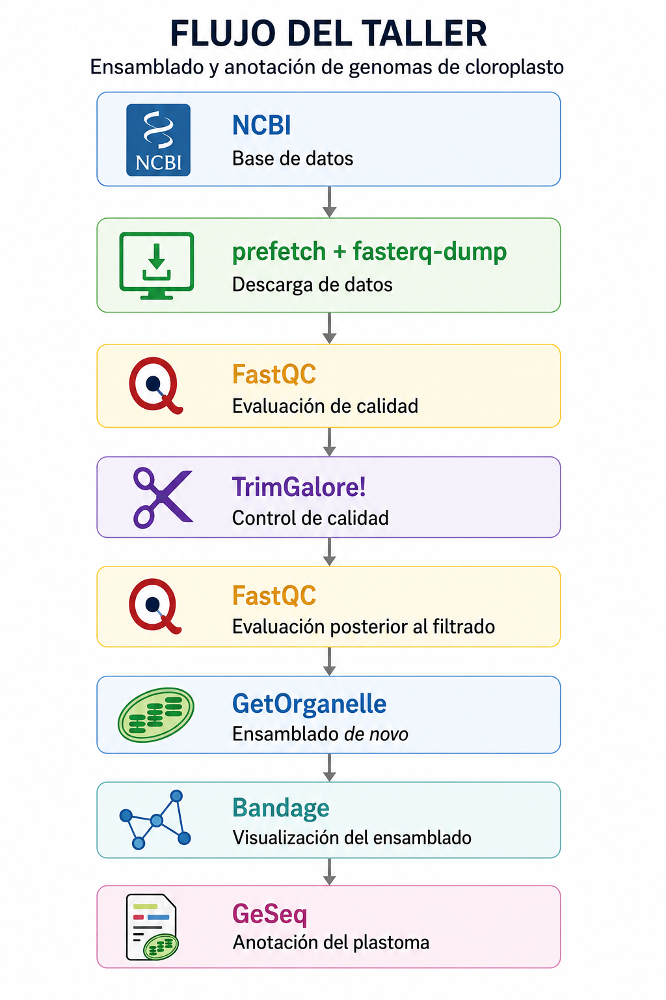

# Introducción al ensamble y anotación de plastomas
---
## El genoma de cloroplasto

---
## Generalidades de la Secuenciación de Nueva Generación (NGS)
Para la generación de los genomas de cloroplasto, la ruta experimental es la Secuenciación de Nueva Generación (NGS) o Secuenciación masiva. Esta consiste en 
xxxx. Consulta la página principal de [Illumina](https://www.illumina.com/science/technology/next-generation-sequencing.html) y este blog de [microbe notes][https://microbenotes.com/illumina-sequencing) para más información. 

El flujo general de trabajo experimental para la obtención de datos de secuenciación masiva es el siguiente: 

**Figura 1.** Flujo de trabajo experimental para la obtención de datos de secuenciación masiva por medio de la plataforma Illumina.

**Conceptos importantes a tener en cuenta:**
1. [Tipos de bibliotecas genómicas](https://www.illumina.com/science/technology/next-generation-sequencing/plan-experiments/paired-end-vs-single-read.html): *Paired-end* y *Single-end*. Algunos programas bioinformáticos solo aceptan un tipo particular de datos o se debe especificar el tipo de biblioteca usado.

**Figura 2.** Comparación entre bibliotecas Single-End (SE) y Paired-End (PE). En las bibliotecas SE se obtiene una lectura por fragmento, mientras que en las bibliotecas PE se secuencian ambos extremos del inserto.

2. Profundidad de la secuenciación: Número de veces que es leído un nucleótido en el fragmento de AND durante el proceso de secuenciación.
3. Calidad de la secuenciación: Precisión con la que se identidica cada nucleótido en las lecutras. Se presenta como un puntaje de calidad (Phred Score, Q).

**Figura 3.** Conceptos de profundidad y calidad de secuenciación. La profundidad indica cuántas veces se ha leído una posición nucleotídica del fragmento de ADN, mientras que la calidad representa la confianza en la identificación de cada nucleótido.

**Factores que afectan el ensamblado de plastomas:**
1. ADN degradado o contaminado (e.g. [Herbario vs tejido fresco](https://repository.naturalis.nl/pub/801326/Bakker-2016-Herbarium-genomics-A.pdf?utm_source=chatgpt.com))
2. Baja proporción de ADN cloroplástico desde la muestra inicial.
3. Profundidad de secuenciación insuficiente.
4. Calidad deficiente de las lecturas.
5. Estrategia de secuenciación no adecuada para organelos (e.g. [RAD-seq](https://www.nature.com/articles/nrg.2015.28), [secuenciación dirigida](https://pmc.ncbi.nlm.nih.gov/articles/PMC8312743/), [RNA-seq](https://onlinelibrary.wiley.com/doi/full/10.1111/mec.17382)). 

---

## Flujo de trabajo del taller

**Figura 4.** Flujo bioinformático a seguir durante este taller. Pasos generales desde la descarga de los datos hasta la anotación de un plastoma. 
