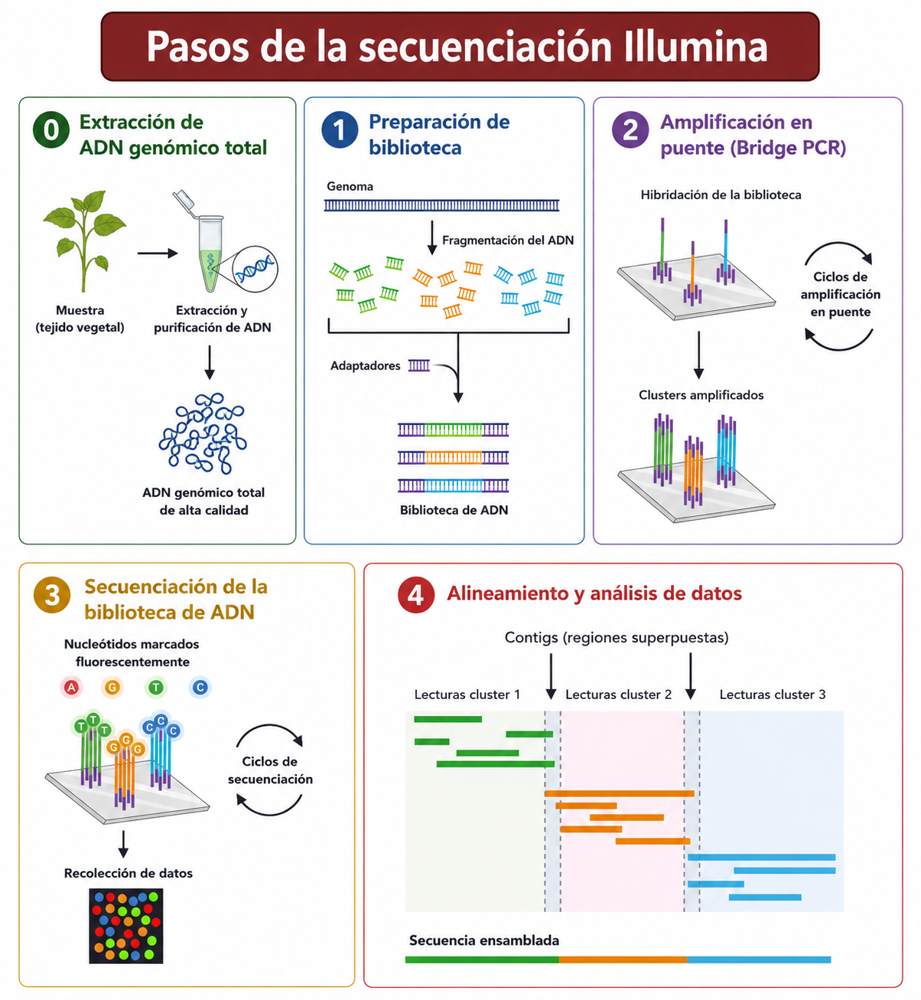
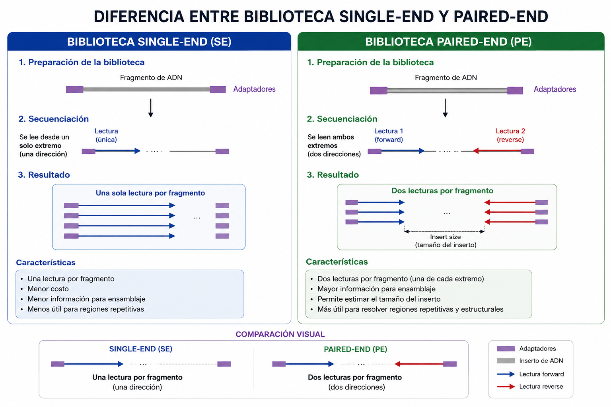
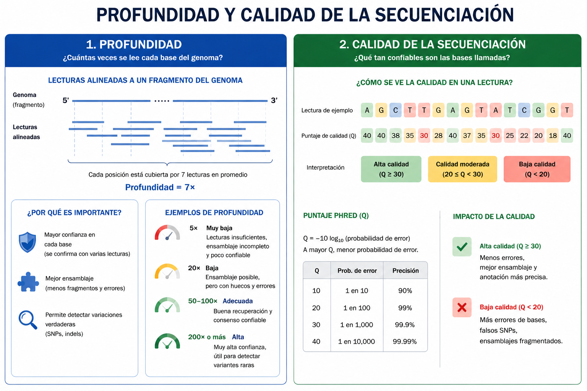

# Introducción del taller
---
## El genoma de cloroplasto

---
## Generalidades de la Secuenciación de Nueva Generación (NGS)

La Secuenciación de Nueva Generación (NGS, por sus siglas en inglés *Next-Generation Sequencing*), también conocida como secuenciación masiva, comprende un conjunto de tecnologías que permiten obtener millones de secuencias de ADN de manera simultánea. En comparación con la secuenciación tradicional de Sanger, la NGS ofrece una mayor capacidad de procesamiento, menor costo por base secuenciada y la posibilidad de analizar genomas completos en una sola corrida de secuenciación.

Para la generación de genomas de cloroplasto, una de las plataformas más utilizadas es Illumina. El proceso inicia con la extracción de ADN genómico total, seguida de la preparación de bibliotecas de secuenciación, la amplificación de fragmentos de ADN sobre una celda de flujo (*flow cell*) y la secuenciación por síntesis. Como resultado, se obtienen millones de lecturas cortas (*reads*) que posteriormente pueden emplearse para reconstruir el genoma de cloroplasto mediante estrategias de ensamblado bioinformático (**Figura 1**).

Consulta la página principal de [Illumina](https://www.illumina.com/science/technology/next-generation-sequencing.html) y este blog de [microbe notes](https://microbenotes.com/next-generation-sequencing-ngs/) para más información. 

El flujo general de trabajo experimental para la obtención de datos de secuenciación masiva es el siguiente: 

**Figura 1.** Flujo de trabajo experimental para la obtención de datos de secuenciación masiva por medio de la plataforma Illumina. Puedes encontrar una descripción general de los pasos [aquí](https://microbenotes.com/illumina-sequencing)

**Conceptos importantes a tener en cuenta:**

1. **[Tipos de bibliotecas genómicas](https://www.illumina.com/science/technology/next-generation-sequencing/plan-experiments/paired-end-vs-single-read.html):** Las bibliotecas pueden ser *Single-end* (SE) o *Paired-end* (PE). En las bibliotecas SE se obtiene una lectura por fragmento de ADN, mientras que en las PE se obtienen dos lecturas (una por cada extremo del fragmento, **Figura 2**). Las bibliotecas PE suelen producir mejores ensamblados y son las más utilizadas para la recuperación de genomas de cloroplasto.
   

**Figura 2.** Comparación entre bibliotecas Single-End (SE) y Paired-End (PE). En las bibliotecas SE se obtiene una lectura por fragmento, mientras que en las bibliotecas PE se secuencian ambos extremos del inserto.

2. **Profundidad de la secuenciación:** Indica cuántas veces, en promedio, se ha leído una misma posición del ADN. A mayor profundidad, mayor confianza en la secuencia reconstruida (**Figura 3**).

3. **Calidad de la secuenciación:** Indica la confiabilidad de las bases identificadas en las lecturas. Se representa mediante el puntaje de calidad (*Phred Score*, Q), donde valores más altos corresponden a una menor probabilidad de error (**Figura 3**).

**Figura 3.** Conceptos de profundidad y calidad de secuenciación. La profundidad indica cuántas veces se ha leído una posición nucleotídica del fragmento de ADN, mientras que la calidad representa la confianza en la identificación de cada nucleótido.

**Factores que afectan el ensamblado de plastomas:**

1. **ADN degradado o contaminado**, lo que reduce la cantidad y calidad de las lecturas obtenidas (e.g. [tejido de herbario vs. tejido fresco](https://repository.naturalis.nl/pub/801326/Bakker-2016-Herbarium-genomics-A.pdf)).

2. **Baja proporción de ADN cloroplástico** en la muestra original, lo que disminuye la cobertura del plastoma durante la secuenciación.

3. **Profundidad de secuenciación insuficiente**, que puede resultar en regiones del plastoma con poca o nula cobertura.

4. **Calidad deficiente de las lecturas**, aumentando la probabilidad de errores durante el ensamblado.

5. **Estrategia de secuenciación no adecuada para la recuperación de organelos**, como algunos enfoques de [RAD-seq](https://www.nature.com/articles/nrg.2015.28), [captura dirigida](https://pmc.ncbi.nlm.nih.gov/articles/PMC8312743/) o [RNA-seq](https://onlinelibrary.wiley.com/doi/full/10.1111/mec.17382), donde la representación del ADN cloroplástico puede ser limitada.

Nota: La presencia de uno o más de estos factores no impide necesariamente la recuperación de un plastoma, pero puede reducir la calidad, completitud o éxito del ensamblado.

---

## Flujo de trabajo del taller

