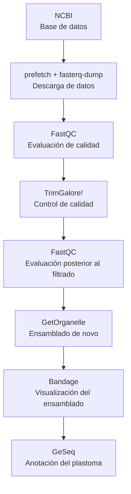

# Introducción al ensamble y anotación de plastomas
---
## El genoma de cloroplasto

---
## Generalidades de la Secuenciación de Nueva Generación (NGS)
Para la generación de los genomas de cloroplasto, la ruta experimental es la Secuenciación de Nueva Generación (NGS) o Secuenciación masiva. Esta consiste en 
xxxx. Consulta la página principal de [Illumina] (https://www.illumina.com/science/technology/next-generation-sequencing.html) y este blog de [microbe notes] [https://microbenotes.com/illumina-sequencing) para más información. 

El flujo general de trabajo experimental para la obtención de datos de secuenciación masiva es el siguiente: 

**Conceptos importantes a tener en cuenta:**
1. [Tipos de bibliotecas genómicas] (https://www.illumina.com/science/technology/next-generation-sequencing/plan-experiments/paired-end-vs-single-read.html): *Pair-end* y *Single-end*. Algunos programas bioinformáticos solo aceptan un tipo particular de datos o se debe especificar el tipo de biblioteca usado.

2. Profundidad y calidad de la secuenciación:  

**Factores que afectan el ensamblado de plastomas:**
1. ADN degradado o contaminado (e.g. [Herbario vs tejido fresco](https://repository.naturalis.nl/pub/801326/Bakker-2016-Herbarium-genomics-A.pdf?utm_source=chatgpt.com))
2. Baja proporción de ADN cloroplástico desde la muestra inicial.
3. Profundidad de secuenciación insuficiente.
4. Calidad deficiente de las lecturas.
5. Estrategia de secuenciación no adecuada para organelos (e.g. RAD-seq, secuenciación dirigida, RNA-seq). 

---

## Flujo de trabajo del taller

