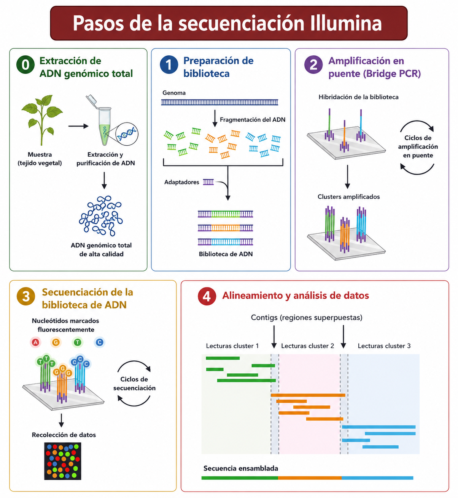

# Introducción del taller
---
## El genoma de cloroplasto y la mitocondria

---
## Generalidades de la Secuenciación de Nueva Generación (NGS)

La Secuenciación de Nueva Generación (NGS, por sus siglas en inglés *Next-Generation Sequencing*), también conocida como secuenciación masiva, comprende un conjunto de tecnologías que permiten obtener millones de secuencias de ADN de manera simultánea. En comparación con la secuenciación tradicional de Sanger, la NGS ofrece una mayor capacidad de procesamiento, menor costo por base secuenciada y la posibilidad de analizar genomas completos en una sola corrida de secuenciación.

Para la generación de genomas de cloroplasto, una de las plataformas más utilizadas es Illumina. El proceso inicia con la extracción de ADN genómico total, seguida de la preparación de bibliotecas de secuenciación, la amplificación de fragmentos de ADN sobre una celda de flujo (*flow cell*) y la secuenciación por síntesis. Como resultado, se obtienen millones de lecturas cortas (*reads*) que posteriormente pueden emplearse para reconstruir el genoma de cloroplasto mediante estrategias de ensamblado bioinformático (**Figura 1**).

Consulta la página principal de [Illumina](https://www.illumina.com/science/technology/next-generation-sequencing.html) y este blog de [microbe notes](https://microbenotes.com/next-generation-sequencing-ngs/) para más información. 

El flujo general de trabajo experimental para la obtención de datos de secuenciación masiva es el siguiente: 

**Figura 2.** Flujo de trabajo experimental para la obtención de datos de secuenciación masiva por medio de la plataforma Illumina. Puedes encontrar una descripción general de los pasos [aquí](https://microbenotes.com/illumina-sequencing)

---
