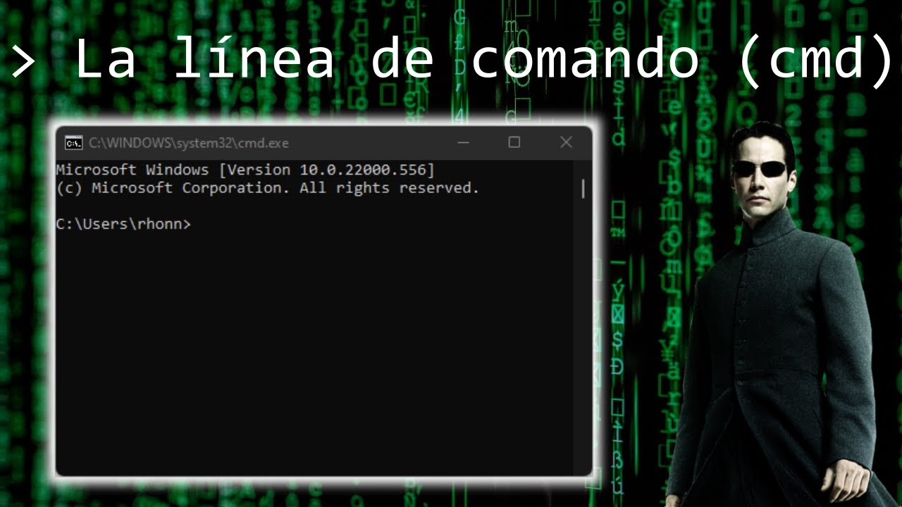
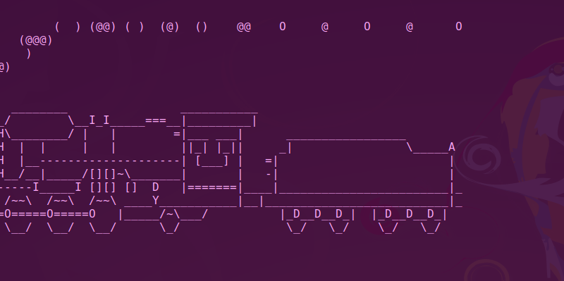

## Introducción a la línea de comandos

### Expectativa

### Realidad

#### ¿Qué es la línea de comandos?
Es una herramienta basada en texto que te permite dar órdenes directas al sistema operativo de tu computadora mediante el teclado.

---
#### Ventajas:
**Tareas simples**: Administrar archivos, crear carpetas o borrar datos. \
**Eficiencia:** Consume menos memoria y potencia que una interfaz gráfica. \
**Automatización:** Ejecutar tareas repetitivas mediante la creación de guiones o scripts. \
**Acceso remoto:** Conectarse a clústers computacionales donde no hay pantallas visuales.

---
#### Comandos básicos:
**ls**: listar archivos y directorios \
**mkdir**: crear un directorio \
**cd**: cambiar directorio \
**touch**: crear un archivo vacío \
**vim**: editor de texto \
**history**: mostrar el historial de comandos \
**cat**: mostrar el contenido de un archivo \
**echo**: imprimir texto en la terminal \
**realpath**: mostrar la ruta absoluta de un archivo o directorio \
**pwd**: mostrar el directorio actual \
**mv**: mover o renombrar archivos y directorios \
**cp**: copiar archivos y directorios \
**rm**: eliminar archivos \
**clear**: limpiar la terminal \
**wget**: descargar archivos desde Internet

**Otras gracias:** \
**date**: mostrar la fecha y hora \
**cal**: mostrar un calendario \
**sl**: necesito relajarme \
sudo apt install sl \
**cmatrix**: estoy trabajando \
sudo apt install cmatrix

**Combos de comandos:** \
**history | grep "vim"** \
Busca en el historial los comandos que contienen "vim". \
**history | grep "cd" | wc -l** \
Buscar en el historial los comandos que contienen "cd" y los cuenta. \
**grep ">" secuencias.fasta | wc -l** \
¿Qué creen que hace?

---

#### Automatización:
#!/bin/bash: shebang

**Vamos a crear una carpeta y dentro un archivo** \
mkdir taller_genomas \
cd taller_genomas \
touch apocosi.sh \
ls

**Ahora vamos a editar apocosi.sh** \
echo '#!/bin/bash' >> apocosi.sh \
cat apocosi.sh \
echo "echo "Esté es muy primer script"' >> apocosi.sh \
echo 'echo "Se agregó la línea shebang a su script"' >> apocosi.sh \
echo 'echo "Hola Mundo"' >> apocosi.sh \
cat apocosi.sh \
echo 'echo "El archivo apocosi.sh se está ejecutando"' >> apocosi.sh \
echo 'touch archivo_serio.txt' >> apocosi.sh \
echo 'echo "Usted ha creado el archivo archivo_serio.txt"' >> apocosi.sh \
echo 'cp archivo_serio.txt ..' >> apocosi.sh \
echo 'echo "El archivo archivo_serio.txt se ha copiado un directorio arriba"' >> apocosi.sh \
echo 'echo "Usted se encuentra acá:"' >> apocosi.sh \
echo 'realpath .' >> apocosi.sh \
echo 'echo "Estos son los archivos al momento:"' >> apocosi.sh \
echo 'ls' >> apocosi.sh \
echo 'rm archivo_serio.txt' >> apocosi.sh \
echo 'echo "Usted ha borrado el archivo_serio.txt de este directorio"' >> apocosi.sh \
echo 'echo "Es hora de descansar"' >> apocosi.sh \
echo 'cmatrix' >> apocosi.sh 

**Ejecutar apocosi.sh** \
./apocosi.sh
