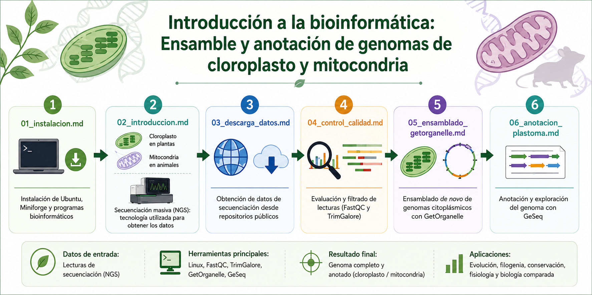

# Taller: Introducción a la bioinformática: Ensamble y anotación de genomas de cloroplasto y mitocondria




## ¡Bienvenidos!

Les damos la bienvenida al repositorio oficial del taller **"Introducción a la bioinformática: Ensamble y anotación de genomas de cloroplasto y mitocondria"** en el marco del XLIV Coloquio de Investigación de la Facultad de Estudios Superiores Iztacala, UNAM.

El objetivo de este repositorio es proporcionar a los participantes los materiales de consulta, comandos, scripts y recursos utilizados durante las actividades prácticas del taller. A lo largo de la jornada, exploraremos los fundamentos de la secuenciación masiva y desarrollaremos un flujo de trabajo reproducible para el ensamblado y la anotación de genomas citoplásmicos utilizando herramientas bioinformáticas de libre acceso.

El genoma de cloropasto y la mitocondria no solo contienen genes esenciales involucrados en procesos biológicos fundamentales como la fotosíntesis y la respiración celular, sino que resguardan la historia evolutiva de las especies que los contienen. Gracias a la creciente disponibilidad de datos genómicos públicos, actualmente es posible recuperar y analizar estos genomas utilizando estrategias bioinformáticas accesibles para estudiantes e investigadores de distintas áreas de las ciencias biológicas.

---

## Objetivo general

Introducir a los participantes en el uso básico de herramientas bioinformáticas para el ensamblado y la anotación de genomas citoplásmicos a partir de datos de secuenciación masiva.

### Objetivos específicos

* Familiarizar a los participantes con las principales tecnologías de secuenciación masiva.
* Introducir el uso básico de la línea de comandos en Linux aplicada a la bioinformática.
* Guiar la obtención y manejo básico de datos genómicos provenientes de repositorios públicos.
* Implementar flujos de trabajo reproducibles para el ensamblado *de novo* y la anotación de genomas de cloroplasto.

---

## Secuencia del taller

| Horario       | Actividad                                                                                                        |
| ------------- | ---------------------------------------------------------------------------------------------------------------- |
| 09:00 – 10:00 | Introducción a las tecnologías de secuenciación masiva y al flujo experimental de generación de datos genómicos. |
| 10:00 – 12:00 | Introducción a Linux, línea de comandos e instalación de programas bioinformáticos.                              |
| 12:00 – 14:00 | Exploración de repositorios públicos y descarga de datos genómicos.                                              |
| 14:30 – 15:30 | Ensamblado *de novo* de genomas citoplásmicos utilizando GetOrganelle.                                           |
| 15:30 – 16:30 | Anotación génica mediante herramientas en línea.                                                                 |
| 16:30 – 17:00 | Integración, interpretación y discusión de resultados.                                                           |

---

## Facilitadores

El taller es impartido por integrantes del Laboratorio de Ecología Molecular y Evolución de la Facultad de Estudios Superiores Iztacala, UNAM:

* **Dr. Vicente de Jesús Castillo Chora** — Investigador posdoctoral.
* **Biól. Néstor Edwin López Ruiz** — Estudiante de Doctorado en Ciencias Biológicas. Correo: nestorlopezruiz99@gmail.com
* **Elba Iztel Nicanor Licona** — Tesista de la Licenciatura en Biología.
* **Erika Yazmín Maldonado González** — Estudiante de la Licenciatura en Biología.
* **Dra. Sofía Solórzano Lujano** — Profesora de Carrera Titular C y responsable del laboratorio.

Desde 2016, el laboratorio desarrolla investigación en ensamblado y anotación de genomas citoplásmicos en plantas, particularmente en cactáceas. Este trabajo ha contribuido a la publicación de los primeros genomas de cloroplasto ensamblados para diversas especies de cactus y del primer genoma mitocondrial reportado para una angiosperma.

---

## Estructura del repositorio

Los materiales del taller se encuentran organizados en los siguientes documentos:

```text
├── 01_instalación_Programas.md
├── 02_Introducción.md
├── 03_descarga_datos.md
├── 04_control_calidad.md
├── 05_ensamblado_getorganelle.md
└── 06_anotacion_plastoma.md
```

### Contenido de cada sección

| Documento                       | Contenido                                                                  |
| ------------------------------- | -------------------------------------------------------------------------- |
| `01_instalacion.md`             | Instalación de Ubuntu, Miniforge y programas bioinformáticos.              |
| `02_Introducción.md`            | Introducción a los genomas de cloroplasto y la secuenciación masiva        |
| `03_descarga_datos.md`          | Introducción a repositorios públicos y descarga de datos de secuenciación. |
| `04_control_calidad.md`         | Evaluación y filtrado de lecturas mediante FastQC y TrimGalore.            |
| `05_ensamblado_getorganelle.md` | Ensamblado *de novo* de genomas citoplásmicos utilizando GetOrganelle.     |
| `06_anotacion_plastoma.md`      | Anotación y exploración de genomas ensamblados mediante GeSeq.             |

---

¡Bienvenidos y mucho éxito durante la sesión!

