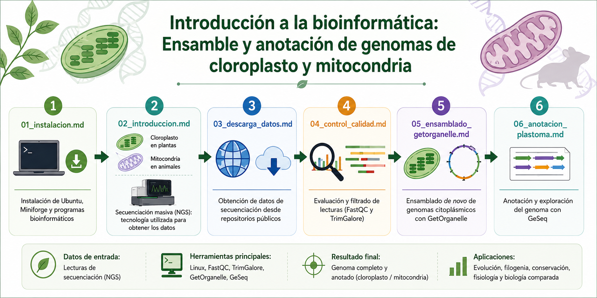

# Taller: Introducción a la bioinformática: Ensamble y anotación de genomas de cloroplasto y mitocondria

## ¡Bienvenidxs!

Les damos la bienvenida al repositorio oficial del taller **"Introducción a la bioinformática: Ensamble y anotación de genomas de cloroplasto y mitocondria"** en el marco del XLIV Coloquio de Investigación de la Facultad de Estudios Superiores Iztacala, UNAM.

---
## Coordinadora
* **Dra. Sofía Solórzano Lujano** — Profesora de Carrera Titular C y responsable del [Laboratorio de Ecología Molecular y Evolución](https://posgrado.iztacala.unam.mx/laboratorio-de-ecologia-molecular-y-evolucion/). \
Correo: sofia.lujano@iztacala.unam.mx 
## Facilitadores
* **Dr. Vicente de J. Castillo Chora** — Investigador posdoctoral. vicentecchora@gmail.com
* **Biól. Néstor Edwin López Ruiz** — Estudiante de Doctorado en Ciencias Biológicas. nestorlopezruiz99@gmail.com
* **Elba Itzel Nicanor Licona** — Tesista de la Licenciatura en Biología.
* **Erika Yazmín Maldonado González** — Estudiante de la Licenciatura en Biología.
---
## Antecedentes
El genoma de cloropasto y la mitocondria no solo contienen genes esenciales involucrados en procesos biológicos fundamentales como la fotosíntesis y la respiración celular, sino que resguardan la historia evolutiva de las especies que los contienen. 

Gracias a la creciente disponibilidad de datos genómicos públicos, actualmente es posible recuperar y analizar estos genomas utilizando estrategias bioinformáticas, las cuáles pueden ser útiles para estudiantes e investigadores de distintas áreas de las ciencias biológicas. 

Desde 2016, el Laboratorio de Ecología Molecular y Evolución desarrolla investigación en ensamblado y anotación de genomas citoplásmicos en plantas, particularmente en cactáceas. Como resultado de este trabajo se ha contribuido a la descripción de los primeros [genomas de cloroplasto ensamblados](https://pubmed.ncbi.nlm.nih.gov/31581555/) para diversas especies de cactus y del [primer genoma mitocondrial](https://pubmed.ncbi.nlm.nih.gov/37653379/) reportado para una angiosperma.

---
## Objetivo general

Introducir a los participantes en el uso básico de herramientas bioinformáticas para el ensamblado y la anotación de genomas citoplásmicos a partir de datos de secuenciación masiva.

### Objetivos específicos

* Familiarizar a los participantes con las principales tecnologías de secuenciación masiva.
* Introducir el uso básico de la línea de comandos en Linux aplicada a la bioinformática.
* Guiar la obtención de datos genómicos provenientes de repositorios públicos.
* Implementar flujos de trabajo reproducibles para el ensamblado *de novo* y la anotación de genomas de cloroplasto.

---

## Estructura del repositorio
El objetivo de este repositorio es proporcionar a los participantes los materiales de consulta, comandos, scripts y recursos utilizados durante las actividades prácticas del taller. A lo largo de la jornada, exploraremos los fundamentos de la secuenciación masiva y desarrollaremos un flujo de trabajo reproducible para el ensamblado y la anotación de genomas citoplásmicos utilizando herramientas bioinformáticas de libre acceso.

Los materiales del taller se encuentran organizados en los siguientes documentos:

| Horario       |       Archivo          | Actividad                                                                                                        |
| ------------- | ----------------| ------------------------------------------------------------------------------------------------ |
| 09:00 – 9:15 |  [01_Instalación_Programas.md](https://github.com/vicentoc/Genome_assembly/blob/Taller_ColoquioFESI_2026/01_Instalaci%C3%B3n_Programas.md)  |Presentación del taller e introducción del repositorio GitHub.|
| 09:15 – 09:45 |   [02_Introducción.md](https://github.com/NestorLR/Genome_assembly/blob/UpDate_13-08-26/01_Instalaci%C3%B3n_Programas.md) | Introducción a los genómas citoplásmicos y a las tecnologías de secuenciación masiva |
| 9:45 – 10:20 | [03_cmd.md](https://github.com/vicentoc/Genome_assembly/blob/main/3_cmd.md)  | Introducción a línea de comandos  |
| 10:20 – 10:50 | [04_flujo_de_trabajo.md](https://github.com/NestorLR/Genome_assembly/blob/UpDate_13-08-26/04_flujo_de_trabajo.md) | Introducción a repositorios públicos y descarga de datos de secuenciación. |
| 10:50 – 11:20 | [04_flujo_de_trabajo.md](https://github.com/NestorLR/Genome_assembly/blob/UpDate_13-08-26/04_flujo_de_trabajo.md) | Preprocesamiento y ensamble *de novo* de genomas citoplásmicos.
| 11:20 – 11:30 | RECESO  |-|
| 11:30 – 12:30 |  [Geseq](https://chlorobox.mpimp-golm.mpg.de/geseq.html) | Anotación génica mediante herramientas en línea. |
| 12:30 – 13:00 |   [Chloroplast genomes](https://link.springer.com/article/10.1186/s12864-025-12498-6) / [Comparative mitogenomics](https://zookeys.pensoft.net/article/152269/)          | Integración, interpretación y discusión de resultados.  |

---

¡Bienvenidxs y mucho éxito durante la sesión!

